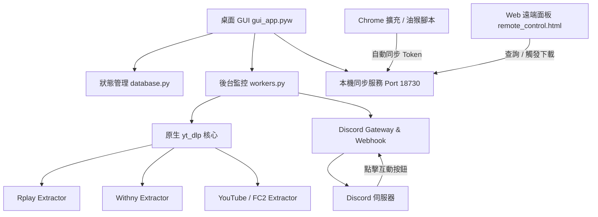

# 📡 SDL (Stream Downloader & Channel Manager / StreamBot)

[](https://www.python.org/)
[](https://github.com/TomSchimansky/CustomTkinter)
[](https://github.com/yt-dlp/yt-dlp)
[](https://discord.com/)
[](LICENSE)

**SDL**（亦稱 **StreamBot**）是一個專為多平台直播與影片串流設計的**現代化自動監控、高速錄製、Discord 雙向連動與遠端管理系統**。

整合深度自訂的原生 `yt-dlp` 提取器、Slate-Dark 桌面視覺介面、Discord Gateway 雙向互動控制、瀏覽器憑證自動同步擴充套件以及 Web 行動遠端控制台，為實況愛好者與存檔需求者提供穩定、高效且優雅的全流程解決方案。

---

## 🌟 核心特色 (Key Features)

### 🎨 1. Taste-Skill Slate-Dark 現代桌面介面
* **專業深空灰黑主題**：採用 Raycast / Linear 風格的 Slate-Dark 配色體系 (`#0b0f17`)，消除混濁底色與廉價感。
* **頂部 Telemetry 遙測數據指標列**：即時掌握「監控頻道數」、「直播開台數」、「活躍錄製任務」、「核心運作狀態」4 大 KPI 橫幅。
* **自適應 Badge 標籤**：狀態標籤依文字自然包裹，完美適配中文字元與 Emoji，杜絕裁切溢出。
* **全域滑鼠滾輪捕獲**：徹底解決 CustomTkinter 在各類子元件上方無法滾動的通病，長設定頁面與日誌清單滑動極致流暢。

### ⚡ 2. 原生 yt-dlp 深度整合提取核心
* **多平台全面支援**：支援 **YouTube**、**Rplay (rplay.live)**、**Withny (withny.fun)**、**FC2 Live (live.fc2.com)** 等平台。
* **原生 Rplay 提取器 (`rplaylive.py`)**：擺脫外部獨立執行檔依賴，支援 8~32 通路並行加速分段下載、Token 失效自動暫停冷卻與自動恢復重試。
* **原生 Withny 提取器 (`withny.py`)**：支援 Next.js App Router RSC 串流解析、NextAuth Session Token 換發、WebSocket 實時握手與 AWS IVS m3u8 自動提取。
* **自訂 Extractor 更新熱注入防護**：透過內建更新器升級官方 `yt-dlp` 時，系統自動備份自訂提取器並熱注入，核心升級永不丟失。

### 🤖 3. Discord Bot 動態即時通知與雙向互動控制
* **動態更新 Embed 卡片**：精簡直觀的直播狀態卡片，已錄製時間每 60 秒透過 API 動態更新。
* **遠端互動式「🔴 開始錄製」按鈕**：純監控頻道開台時，Discord 卡片自動附帶互動按鈕，管理員可在 Discord 上一鍵觸發後台啟動錄影。
* **通知分流路由**：支援將進行中動態狀態卡片與下載完成通知（`discord_completed_channel_id`）分流發送至不同頻道。
* **防重複與斷線重建**：具備 Session ID 執行緒防重複機制與 Discord Gateway WebSocket 斷線自動重建機制。

### 🌐 4. 瀏覽器擴充套件與多端遠端控制
* **Chrome 擴充套件 (`chrome_extension/`)**：使用原生 Chrome Cookies API 自動擷取 Withny / Rplay Token，一鍵或自動背景同步至本機 StreamBot 伺服器 (Port 18730)。
* **Tampermonkey 油猴腳本**：提供 PC 端與行動端專用腳本 (`streambot_*.user.js`)，瀏覽網頁時自動完成憑證無感同步。
* **行動端遠端控制面板 (`remote_control.html`)**：精美的響應式 Web 控制台，手機隨時查看頻道狀態、發起手動分段或完整下載。

---

## 🏗️ 系統架構 (Architecture)



---

## 📦 目錄結構 (Project Structure)

```text
SDL/
├── gui_app.pyw                          # 現代化 GUI 主程式入口
├── config.py                            # 基礎路徑與預設組態定義
├── database.py                          # 組態持久化、頻道與歷史資料庫模組
├── workers.py                           # 各平台背景輪詢、監控、錄製與 Discord 連動工作緒
├── updater.py                           # 元件檢查、升級與自訂 Extractor 熱注入防護
├── utils.py                             # 跨平台公用工具、進程樹管理與暫存清理
├── remote_control.html                  # 響應式行動端遠端控制面板
├── streambot_rplay_sync.user.js         # Rplay Token 油猴同步腳本
├── streambot_withny_sync_pc.user.js     # Withny PC 端油猴同步腳本
├── streambot_withny_sync_mobile.user.js # Withny 行動端油猴同步腳本
├── chrome_extension/                    # StreamBot Chrome 擴充套件
│   ├── manifest.json
│   ├── background.js
│   ├── popup.html
│   └── popup.js
├── yt_dlp/                              # 整合式原生 yt-dlp 核心
│   └── extractor/
│       ├── rplaylive.py                 # 自訂 Rplay 原生提取器
│       └── withny.py                    # 自訂 Withny 原生提取器
├── bundle/                              # 打包與容器化輔助腳本
├── ffmpeg.exe                           # 多媒體解碼與封裝工具
├── withny-dl-windows-amd64.exe          # Withny 集中式輔助工具
└── settings.json                        # 系統設定檔（發布端保持乾淨預設值）
```

---

## 🚀 快速開始 (Quick Start)

### 1. 環境需求
* **作業系統**：Windows 10 / 11 (亦支援 Linux 基礎核心)
* **Python 版本**：Python 3.10+

### 2. 安裝相依套件
在終端機中安裝所需套件：
```bash
pip install customtkinter requests pillow websocket-client urllib3
```

### 3. 啟動程式
雙擊執行 `gui_app.pyw` 或在終端機中執行：
```bash
python gui_app.pyw
```

### 4. 設定與憑證配置
1. **下載目錄**：在「系統設定」分頁指定錄製存檔資料夾。
2. **Discord Bot 設定**（選填）：填入 Discord Bot Token 與目標頻道 ID，即可享有即時動態卡片與互動錄製按鈕。
3. **平台憑證**：
   - 可在設定介面手動填入 Rplay Token / Withny Session Token。
   - 或安裝 `chrome_extension/` 擴充套件 / `streambot_*.user.js` 腳本，登入網頁時自動同步。

---

## 🔒 安全性宣告 (Security & Privacy)

* **開源安全性**：本開源儲存庫 (`BMtobi/SDL`) 嚴格遵循無敏感資訊政策，所有設定檔均為乾淨預設值。
* **本機憑證保護**：您的 Token、密碼與 Discord Bot 憑證僅會儲存在您本機的 `settings.json` 與 `credentials.yaml`，請勿將包含個人憑證的檔案公開上傳。

---

## 📄 授權說明 (License)

本專案遵循 MIT License 開源協議。整合之第三方工具（如 `yt-dlp`、`FFmpeg` 等）之智慧財產權與授權條款歸其原作者所有。
